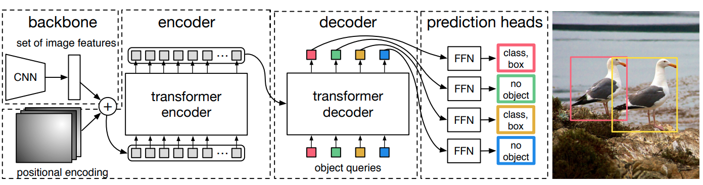
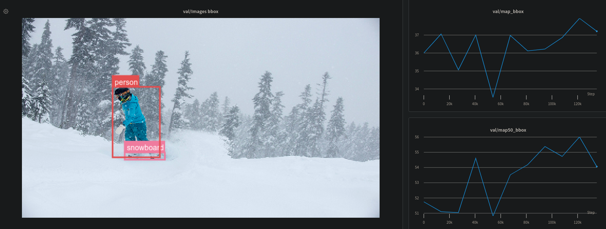
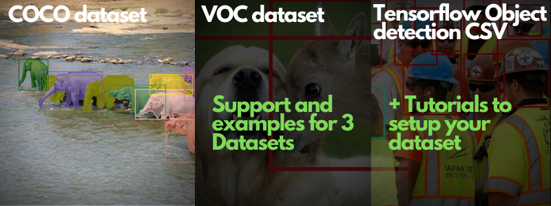
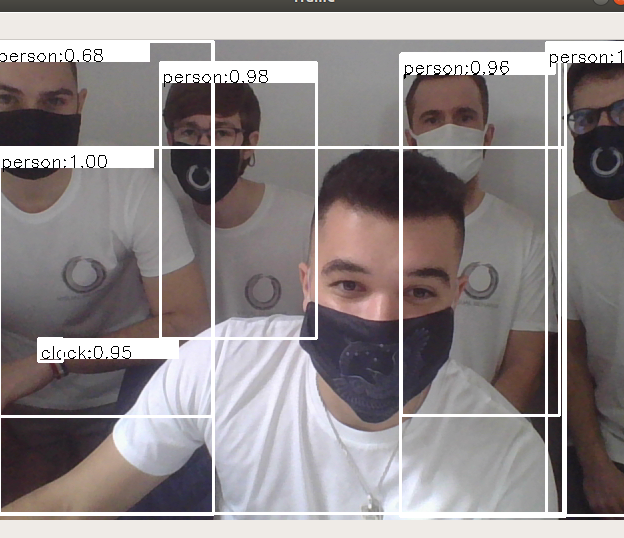

# DETR : End-to-End Object Detection with Transformers (Tensorflow)

Tensorflow implementation of DETR : Object Detection with Transformers, including code for inference, training, and finetuning. DETR is a promising model that brings widely adopted transformers to vision models. We believe that models based on convolution and transformers will soon become the default choice for most practitioners because of the simplicity of the training procedure: NMS and anchors free! Therefore this repository is a step toward making this type of architecture widely available. 

* [1. Install](#install)
* [2. Datasets](#datasets)
* [3. Tutorials](#tutorials)
* [4. Finetuning](#finetuning)
* [5. Training](#training)
* [5. Inference](#inference)
* [6. Inference with TensorRT](#inference-with-tensorrt)
* [7. Acknowledgement](#acknowledgement)


<b>DETR paper:</b> https://arxiv.org/pdf/2005.12872.pdf <br>
<b>Torch implementation: https://github.com/facebookresearch/detr</b>

</img>

<b>About this implementation:</b> This repository includes codes to run an inference with the original model's weights (based on the PyTorch weights), to train the model from scratch (multi-GPU training support coming soon) as well as examples to finetune the model on your dataset. Unlike the PyTorch implementation, the training uses fixed image sizes and a standard Adam optimizer with gradient norm clipping.

Additionally, our logging system is based on https://www.wandb.com/ so that you can get a great visualization of your model performance!

- Checkout our logging board with the reports here: https://wandb.ai/thibault-neveu/detr-tensorflow-log

</img>

## Install

The code has been currently tested with Tensorflow 2.3.0 and python 3.7. The following dependencies are required.


```
wandb
matplotlib
numpy
pycocotools
scikit-image
imageio
pandas
```

```
pip install -r requirements.txt
```


## Datasets


This repository currently supports three dataset formats: **COCO**, **VOC**, and **Tensorflow Object detection csv**. The easiest way to get started is to set up your dataset based on one of these formats. Along with the datasets, we provide a code example to finetune your model.
Finally, we provide a jupyter notebook to help you understand how to load a dataset, set up a custom dataset, and finetune your model.

</img>

## Tutorials

To get started with the repository you can check the following Jupyter notebooks:

- ✍ [DETR Tensorflow - How to load a dataset.ipynb](https://github.com/Visual-Behavior/detr-tensorflow/blob/main/notebooks/How%20to%20load%20a%20dataset.ipynb)
- ✍ [DETR Tensorflow - Finetuning tutorial.ipynb](https://github.com/Visual-Behavior/detr-tensorflow/blob/main/notebooks/DETR%20Tensorflow%20-%20%20Finetuning%20tutorial.ipynb)
- ✍ [DETR Tensorflow - How to setup a custom dataset.ipynb](https://github.com/Visual-Behavior/detr-tensorflow/blob/main/notebooks/DETR%20Tensorflow%20-%20%20How%20to%20setup%20a%20custom%20dataset.ipynb)

As well as the logging board on wandb https://wandb.ai/thibault-neveu/detr-tensorflow-log and this report:

- 🚀 [Finetuning DETR on Tensorflow - A step by step guide](https://wandb.ai/thibault-neveu/detr-tensorflow-log/reports/Finetuning-DETR-on-Tensorflow-A-step-by-step-tutorial--VmlldzozOTYyNzQ)


## Evaluation

Run the following to evaluate the model using the pre-trained weights. 
- **data_dir** is your coco dataset folder
- **img_dir** is the image folder relative to the data_dir
- **ann_file** is the validation annotation file relative to the data_dir

Checkout ✍ [DETR Tensorflow - How to load a dataset.ipynb](https://github.com/Visual-Behavior/detr-tensorflow/blob/main/notebooks/How%20to%20load%20a%20dataset.ipynb) for more information about the supported dataset ans their usage.

```
python eval.py --data_dir /path/to/coco/dataset --img_dir val2017 --ann_file annotations/instances_val2017.json
```

Outputs:

```
       |  all  |  .50  |  .55  |  .60  |  .65  |  .70  |  .75  |  .80  |  .85  |  .90  |  .95  |
-------+-------+-------+-------+-------+-------+-------+-------+-------+-------+-------+-------+
   box | 36.53 | 55.38 | 53.13 | 50.46 | 47.11 | 43.07 | 38.11 | 32.10 | 25.01 | 16.20 |  4.77 |
  mask |  0.00 |  0.00 |  0.00 |  0.00 |  0.00 |  0.00 |  0.00 |  0.00 |  0.00 |  0.00 |  0.00 |
-------+-------+-------+-------+-------+-------+-------+-------+-------+-------+-------+-------+

```

The result is not the same as reported in the paper because the evaluation is run on the <b>original image size</b> and not on the larger images. The actual implementation resizes the image so that the shorter side is at least 800pixels and the longer side at most 1333.


## Finetuning

To fine-tune the model on a new dataset we siply need to set the number of class to detect in our new dataset (**nb_class**). The method will remove the last layers that predict the box class&positions and add new layers to finetune.

```python
# Load the pretrained model
detr = get_detr_model(config, include_top=False, nb_class=3, weights="detr", num_decoder_layers=6, num_encoder_layers=6)
detr.summary()

# Load your dataset
train_dt, class_names = load_tfcsv_dataset(config, config.batch_size, augmentation=True)

# Setup the optimziers and the trainable variables
optimzers = setup_optimizers(detr, config)

# Train the model
training.fit(detr, train_dt, optimzers, config, epoch_nb, class_names)
```
The following commands gives some examples to finetune the model on new datasets:  (Pacal VOC) and (The Hard hat dataset), with a real ```batch_size``` of 8 and a virtual ```target_batch``` size (gradient aggregate) of 32. ```--log``` is used for logging the training into wandb. 

- **data_dir** is your voc dataset folder
- **img_dir** is the image folder relative to the data_dir
- **ann_file** is the validation annotation file relative to the data_dir

```
python finetune_voc.py --data_dir /home/thibault/data/VOCdevkit/VOC2012 --img_dir JPEGImages --ann_dir Annotations --batch_size 8 --target_batch 32  --log

```
- **data_dir** is the hardhatcsv dataset folder
- **img_dir** and  **ann_file** set in the training file to load the training and validation differently

Checkout ✍ [DETR Tensorflow - How to load a dataset.ipynb](https://github.com/Visual-Behavior/detr-tensorflow/blob/main/notebooks/How%20to%20load%20a%20dataset.ipynb) for more information about the supported dataset ans their usage.

```
python  finetune_hardhat.py --data_dir /home/thibault/data/hardhat --batch_size 8 --target_batch 32 --log
```

## Training

(Multi GPU training comming soon)


- **data_dir** is the coco dataset folder
- **img_dir** and  **ann_file** set in the training file to load the training and validation differently.

```
python train_coco.py --data_dir /path/to/COCO --batch_size 8  --target_batch 32 --log
```

## Inference

Here is an example of running an inference with the model on your webcam.

```
python webcam_inference.py 
```

</img>

## Inference with TensorRT

### Requirements:
```
cmake >= 3.8
TensorRT 8
```
To install TensorRT 8, follow [NVIDIA TensorRT official installation guide](https://docs.nvidia.com/deeplearning/tensorrt/install-guide/index.html).

Python package requirements:
```
onnx
tf2onnx
```

### Custom plugin for Deformable DETR
Deformable DETR use a custom operation Im2Col in its Transformer layer. This operation is not supported by TensorRT so we need to build a TensorRT custom plugin from source.

```
cd detr_tensorrt/plugins/ms_deform_im2col
mkdir build && cd build
cmake .. \
       -DTRT_LIB=/path/to/tensorrt/lib/
       -DTRT_INCLUDE=/path/to/tensorrt/include/
       -DCUDA_ARCH_SM=/your_gpu_cuda_arch/
make -j
```
For more detail, see: `detr_tensorrt/plugins/ms_deform_im2col/README.txt` 

Parameters:
- `-DTRT_LIB`: Path to TensorRT lib. It could be `YOUR_TENSORRT_DIR/lib` or `/usr/lib/x86_64-linux-gnu`
- `-DTRT_INCLUDE`: Path to TensorRT C++ include. It could be `YOUR_TENSORRT_DIR/include` or `/usr/include/x86_64-linux-gnu`
- `-DCUDA_ARCHE_SM`: Compute capability of your NVIDIA GPU. Example: `70` for Tesla V100. Check [here](https://arnon.dk/matching-sm-architectures-arch-and-gencode-for-various-nvidia-cards/) for other GPU.

### Workflow
Tensorflow model --> ONNX --> TensorRT serialized engine

#### Export Tensorflow graph to ONNX graph:

For each model (detr/deformable-detr), we have:
```
python3 detr_tensorrt/export_onnx.py MODEL_NAME 
       [--input_shape H W] 
       [--save_to DIR_TO_SAVE_ONNX_FILE]
```
Parameters:
- `--input_shape`: image height and width, default: 1280 1920
- `--save_to`: directory that onnx file will be saved to. Default: `./weights/MODEL_NAME/MODEL_NAME_trt/`

#### Convert ONNX model to TensorRT serialized engine:
```
python3 detr_tensorrt/onnx2engine.py MODEL_NAME
       [--precision PRECISION]
       [--onnx_dir ONNX_DIR]
       [--verbose]
```
Parameters:
- `--precision`: precision of model weights: FP32, FP16, MIX. MIX precision will let TensorRT the freedom to optimize weights as either FP32 or FP16. In most cases, the inference time between FP16 and MIX has no big difference.
- `--onnx_dir`: directory containing the ONNX file to be converted to TensorRT engine. The required ONNX file must be named `MODEL_NAME.onnx`. Default: `./weights/MODEL_NAME/MODEL_NAME_trt/`
- `--verbose`: Print out TensorRT log of all levels

The TensorRT serialized engine will be saved in `ONNX_DIR/MODEL_NAME_PRECISION.engine`

### Run inference
An example of inference with a test image: `images/test.jpeg`

```
python tensorrt_inference.py --engine_path ENGINE_PATH
```

Inference time in milisecond:
|               | DETR | Deformable DETR |
|---------------|------|-----------------|
| Tensorflow    | 100  | 160             |
| TensorRT FP32 | 60   | 100             |
| TensorRT FP16 | 27   | 60              |

## Acknowledgement

The pretrained weights of this models are originaly provide from the Facebook repository https://github.com/facebookresearch/detr and made avaiable in tensorflow in this repository: https://github.com/Leonardo-Blanger/detr_tensorflow
